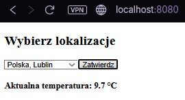

#Zadanie 1 - Programowanie Aplikacji w Chmurze Obliczeniowej

##1. Kod aplikacji (server.c) zaimplementowanej w języku C jako serwer HTTP. Realizuje logowanie danych przy starcie oraz udostępnia interfejs do sprawdzania pogody.

```c
#include <stdio.h>
#include <stdlib.h>
#include <string.h>
#include <unistd.h>
#include <time.h>
#include <arpa/inet.h>

//port nasluchu serwera HTTP
#define PORT 8080

//komunikacja z API (Open-Meteo) realizowana jest asynchronicznie po stronie klienta, co pozwala na brak zaleznosci SSL.
const char *html =
"HTTP/1.1 200 OK\r\n"
"Content-Type: text/html; charset=UTF-8\r\n"
"Connection: close\r\n"
"\r\n"
"<!DOCTYPE html>"
"<html><head><title>Zadanie 1 - Pogoda</title></head>"
"<body>"
"<h2>Wybierz lokalizacje</h2>"
"<select id='loc'>"
"<option value='51.2465,22.5684'>Polska, Lublin</option>"
"<option value='52.2297,21.0122'>Polska, Warszawa</option>"
"<option value='48.8534,2.3488'>Francja, Paryz</option>"
"</select>"
"<button onclick='getWeather()'>Zatwierdz</button>"
"<div id='res' style='margin-top: 20px; font-weight: bold;'></div>"
"<script>"
"function getWeather() {"
"  var loc = document.getElementById('loc').value.split(',');"
"  fetch('[https://api.open-meteo.com/v1/forecast?latitude='+loc](https://api.open-meteo.com/v1/forecast?latitude='+loc)[0]+'&longitude='+loc[1]+'&current_weather=true')"
"  .then(r=>r.json()).then(d=>{"
"    document.getElementById('res').innerHTML = 'Aktualna temperatura: ' + d.current_weather.temperature + ' °C';"
"  });"
"}"
"</script>"
"</body></html>";

//funkcja do Healthchecka, nawiazuje lokalne polaczenie TCP i weryfikuje odpowiedz serwera.
int do_healthcheck() {
    int sock = 0;
    struct sockaddr_in serv_addr;
    if ((sock = socket(AF_INET, SOCK_STREAM, 0)) < 0) return 1;
    serv_addr.sin_family = AF_INET;
    serv_addr.sin_port = htons(PORT);
    if (inet_pton(AF_INET, "127.0.0.1", &serv_addr.sin_addr) <= 0) return 1;
    if (connect(sock, (struct sockaddr *)&serv_addr, sizeof(serv_addr)) < 0) return 1;
    char *req = "GET / HTTP/1.0\r\n\r\n";
    send(sock, req, strlen(req), 0);
    char buffer[16] = {0};
    if (read(sock, buffer, 15) <= 0) return 1;
    return 0; //0 oznacza status 'healthy'
}

int main(int argc, char const *argv[]) {
    //przechwycenie flagi --healthcheck
    if (argc > 1 && strcmp(argv[1], "--healthcheck") == 0) {
        return do_healthcheck();
    }

    //aktualny czas
    char date_str[64];
    time_t now = time(NULL);
    struct tm *t = localtime(&now);
    strftime(date_str, sizeof(date_str)-1, "%Y-%m-%d %H:%M:%S", t);

    //logi
    printf("Data uruchomienia: %s\n", date_str);
    printf("Autor: Kacper Madyński\n"); 
    printf("Port TCP: %d\n", PORT);
    fflush(stdout);

    //inicjalizacja gniazda sieciowego i przypisanie adresu
    int server_fd, new_socket;
    struct sockaddr_in address;
    int opt = 1;
    int addrlen = sizeof(address);

    if ((server_fd = socket(AF_INET, SOCK_STREAM, 0)) == 0) exit(1);
    if (setsockopt(server_fd, SOL_SOCKET, SO_REUSEADDR, &opt, sizeof(opt))) exit(1);

    address.sin_family = AF_INET;
    address.sin_addr.s_addr = INADDR_ANY;
    address.sin_port = htons(PORT);

    if (bind(server_fd, (struct sockaddr *)&address, sizeof(address)) < 0) exit(1);
    if (listen(server_fd, 10) < 0) exit(1); //ustawienie trybu nasluchiwania

    //przychodzace polaczenia HTTP i zwraca dokument HTML
    while(1) {
        if ((new_socket = accept(server_fd, (struct sockaddr *)&address, (socklen_t*)&addrlen)) < 0) continue;
        char buffer[1024] = {0};
        read(new_socket, buffer, 1024);
        write(new_socket, html, strlen(html));
        close(new_socket);
    }
    return 0;
}
```
##2. Plik Dockerfile wykorzystuje wieloetapowe budowanie oraz obraz bazowy scratch w celu minimalizacji rozmiaru. Zawiera etykiety OCI oraz mechanizm HEALTHCHECK.

```Dockerfile
#wieloetapowe budowanie obrazu
FROM alpine:3.19 AS builder

#instalacja kompilatora GCC i MUSL
RUN apk add --no-cache gcc musl-dev
WORKDIR /src

#kopiowanie kodu na koncu etapu dla optymalizacji cache
COPY server.c ./

#kompilacja kodu do pojedynczego pliku:
#-static (niezbedne dla scratch)
#-Os najmniejszy rozmiar
#-s usuwa tabele symboli
RUN gcc -static -Os -s -o server server.c

#minimalny obraz koncowy
FROM scratch

#etykiety zgodnie z OCI
LABEL org.opencontainers.image.authors="Kacper Madyński"
LABEL org.opencontainers.image.title="Zadanie 1"

#strefa czasowa w formacie POSIX
ENV TZ="CET-1CEST,M3.5.0,M10.5.0/3"

#kopiowanie tylko binarium z pierwszego etapu
COPY --from=builder /src/server /server

#port sieciowy
EXPOSE 8080

#uruchamia skompilowana aplikacje, unikajac zewnetrznego curla i dodatkowych warstw
HEALTHCHECK --interval=10s --timeout=3s --retries=3 \
    CMD ["/server", "--healthcheck"]

#punkt wejscia dla kontenera
CMD ["/server"]
```
##3. Polecenia weryfikacyjne
###Zbudowanie obrazu kontenera:
docker build -t zadanie1:v1 .
###Uruchomienie kontenera:
docker run -d -p 8080:8080 --name pogoda_app zadanie1:v1
###Uzyskanie informacji z logów:
docker logs pogoda_app
###Sprawdzenie liczby warstw oraz rozmiaru obrazu:
docker history zadanie1:v1
docker images zadanie1:v1

##4. Weryfikacja działania
Adres: http://localhost:8080 

