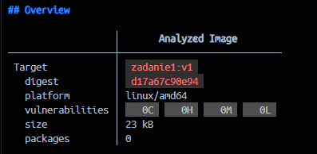

Zadanie 1 - Część Dodatkowa (Wersja 3)

1. Weryfikacja podatności na zagrożenia (CVE)
Zgodnie z wymaganiami, opracowane obrazy kontenerów zostały poddane analizie pod kątem podatności na zagrożenia za pomocą narzędzia Docker Scout. Raporty zapisano w repozytorium.

Wykorzystane polecenia:
1. Skanowanie obrazu z części obowiązkowej:
`docker scout cves zadanie1:v1 > raport_cve_v1.txt`

3. Skanowanie obrazu wieloplatformowego z części dodatkowej:
`docker scout cves --platform linux/amd64 pawcokm/zadanie1:v3 > raport_cve_v3.txt`

Wynik i uzasadnienie:
W strumieniu wyjściowym nie wykryto podatności. Obrazy nie zawierają zagrożeń zakwalifikowanych jako CRITICAL lub HIGH. Stan ten wynika z zastosowania pustego obrazu bazowego (`scratch`) oraz kompilacji statycznej (`-static`) kodu źródłowego w języku C, co całkowicie eliminuje systemowe komponenty i biblioteki dynamiczne z finalnego kontenera.

2. Architektura wieloplatformowa, BuildKit i Cache
Zbudowano obraz zgodny z architekturami `linux/amd64` oraz `linux/arm64`. Konfiguracja środowiska wymagała utworzenia buildera opartego na sterowniku `docker-container`. Implementacja pliku Dockerfile wykorzystuje rozszerzony frontend BuildKit. Kod źródłowy jest pobierany bezpośrednio z repozytorium GitHub za pomocą mechanizmu bezpiecznego wstrzykiwania poświadczeń (`--mount=type=secret`). Pamięć podręczna procesu jest optymalizowana poprzez użycie eksportera `registry` w trybie `max`.

Tworzenie i aktywacja buildera:
`docker buildx create --name pawcho-builder --driver docker-container --use`
`docker buildx inspect --bootstrap`

Budowa i dystrybucja obrazu:
`docker buildx build --platform linux/amd64,linux/arm64 --secret id=git_token,src=token.txt --cache-to type=registry,ref=pawcokm/zadanie1:cache,mode=max --cache-from type=registry,ref=pawcokm/zadanie1:cache -t pawcokm/zadanie1:v3 --push .`
